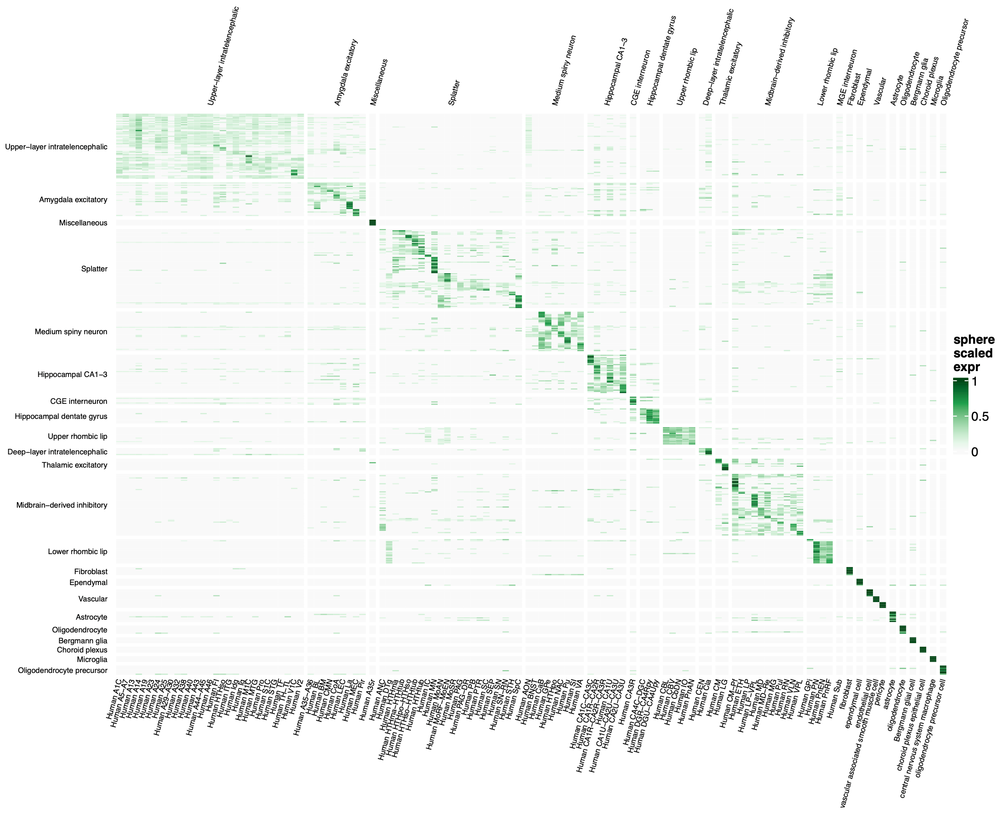

```{r, include = FALSE}
knitr::opts_chunk$set(
  collapse = TRUE
)
```

# Brain Atlas

We use the Human Brain Atlas 1.0 dataset as an example of deconvolution of a
large single cell dataset. The brain atlas data is split into 2 files, one
containing neurons only whih has roughly 2.5 million cells, while the other
dataset contains the remaining non-neuronal cells. For a smaller, simpler
example see the cellGeometry quickstart vignette. The data is available on the
CZ cellxgene repository, described here:
https://cellxgene.cziscience.com/collections/283d65eb-dd53-496d-adb7-7570c7caa443

The h5ad file for all neurons (33 Gb) can be downloaded directly using this link:
https://datasets.cellxgene.cziscience.com/c2f66cd5-4ff4-4578-876c-55783a57cf8f.h5ad

The h5ad file for the remaining 888,263 non-neuronal cells (4 Gb) can be
downloaded from this link:
https://datasets.cellxgene.cziscience.com/99f27be8-9fac-451e-9723-9e4c7191589e.h5ad

```{r eval=FALSE}
library(zellkonverter)
library(SingleCellExperiment)
library(cellGeometry)
```

## Neurons

We load the data from the h5ad file and extract the single cell matrix.

```{r eval=FALSE}
# 33 Gb
# 2,480,956 cells
brain <- readH5AD("../c2f66cd5-4ff4-4578-876c-55783a57cf8f.h5ad",
                  use_hdf5 = TRUE, reader = "R")

mat <- brain@assays@data$X
rownames(mat) <- rownames(brain)  # need to add rownames (genes)
meta <- brain@colData@listData
```

We then define the cellMarkers objects. This is the most time consuming part of
the analysis. There are options here for which metadata column to use for
defining subclasses and groups. Here we use `roi` and `supercluster_term` as
subclass and group respectively. Other possible columns in `meta` are
`dissection` (fine subregions) and `ROIgroupfine` (similar to tissue region).

```{r eval=FALSE}
# shows possible cell cluster subclasses and groups
sort(table(meta$roi))
sort(table(meta$supercluster_term))

mk <- cellMarkers(mat, subclass = meta$roi,
                  cellgroup = meta$supercluster_term, 
                  dual_mean = TRUE, cores = 8)
# 27 mins (intel 8 cores)
```

We load a recent ensembl database to convert ensembl ids to gene names. This is
optional and can be done at a later stage for users that prefer to use ensembl
ids for analysis and only convert to gene names only during plotting.

```{r eval=FALSE}
library(AnnotationHub)
ah <- AnnotationHub()
ensDb_v110 <- ah[["AH113665"]]

mk <- gene2symbol(mk, ensDb_v110)
```

We can visualise the signature heatmap as follows.

```{r eval=FALSE}
signature_heatmap(mk, text = FALSE, show_row_names = FALSE,
                  row_title_rot = 0, column_title_rot = 45)
```

## Non-neuronal cells

Next we generate cellMarkers for the non-neuronal cells.

```{r eval=FALSE}
# non-neuronal cells
# 888,263 cells
# 4 Gb
brainNN <- readH5AD("../99f27be8-9fac-451e-9723-9e4c7191589e.h5ad",
                    use_hdf5 = TRUE, reader = "R")

mat2 <- brainNN@assays@data$X
rownames(mat2) <- rownames(brainNN)  # add rownames (genes)
meta2 <- brainNN@colData@listData

sort(table(meta2$supercluster_term))
sort(table(meta2$cell_type))

mkNN <- cellMarkers(mat2, subclass = meta2$cell_type,
                    cellgroup = meta2$supercluster_term,
                    dual_mean = TRUE, cores = 8)
# 9 mins (intel 8 cores)

mkNN <- gene2symbol(mkNN, ensDb_v110)

signature_heatmap(mkNN)
```

# Merging signatures

Next we merge the cellMarkers objects for both the neuronal and non-neuronal
datasets. In this example we set `transform` to `"none"` as we know that both
single-cell datasets were performed using the same chemistry and same setup, so
there is no major difference in scaling between the datasets. When merging other
single cell datasets which are more disparate then we recommend leaving
`transform` as its default `"qq"`, which uses quantile mapping to map one
single-cell dataset to another based on the distribution of the gene means
across the subclasses.

```{r eval=FALSE}
mkm <- mergeMarkers(mk, mkNN, transform = "none")
mkm <- updateMarkers(mkm, expfilter = 0.2)
```

We can view merged gene signature from both single cell datasets using 
`signature_heatmap()`. Here genes are scaled using sphere scaling to highlight 
the differences between subclasses. This mimics the signature matrix applied 
when `weight_method = "equal"`.

```{r eval=FALSE}
signature_heatmap(mkm, top = 5,
                  text = FALSE, show_row_names = FALSE,
                  row_title_rot = 0, column_title_rot = 75,
                  scale = "sphere")
```

```{r, out.width='100%', echo=FALSE}

```

The full signature matrix is very large containing 1542 genes across 116 
subclasses. So we can focus in on a particular group of cell types as follows.

```{r eval=FALSE}
# view signature for just the Amygdata excitatory group
signature_heatmap(mkm, subset = "Amygdala excitatory")
```

```{r, out.width='50%', fig.align = 'center', echo=FALSE}

```

# Simulating pseudobulk

To generate a simulated pseudobulk dataset, we generate simulation datasets
based on sampling each of the neuronal and non-neuronal raw single-cell count
matrices.

```{r eval=FALSE}
# generate neuronal cell count samples
set.seed(3)
sim_counts <- generate_samples(mk, 30)
sim_percent <- sim_counts / rowSums(sim_counts) * 100

# simulate neuronal bulk
# sample from neuronal count matrix
# 35 mins (Intel)
sim_sampled <- simulate_bulk(mat, sim_counts, meta$roi,
                             times = 1)

rownames(sim_sampled) <- gene2symbol(rownames(sim_sampled), ensDb_v110)
```

Once we have generated the simulation dataset from the neuronal matrix, the code
below shows how to deconvolute it alone without the merging of the non-neuronal
cells. This can be skipped if you want to merge with the non-neuronal cells and
deconvolute the whole lot.

```{r eval=FALSE}
fit <- deconvolute(mk, sim_sampled,
                   arith_mean = TRUE,
                   use_filter = FALSE)
mset <- metric_set(sim_percent, fit$subclass$percent)
summary(mset)

pdf("../brain_sim_neuron.pdf",
    width = 12, height = 12.5)
plot_set(sim_counts, fit$subclass$output, show_zero = T,
         mfrow = c(8, 8))
plot_set(sim_percent, fit$subclass$percent, show_zero = T,
         mfrow = c(8, 8))
dev.off()
```

Next we set up the simulated bulk data from the non-neuronal single cell matrix.

```{r eval=FALSE}
# generate non-neuronal cell count samples
set.seed(3)
sim_countsNN <- generate_samples(mkNN, 30)
sim_percentNN <- sim_countsNN / rowSums(sim_countsNN) * 100

# simulate non-neuronal bulk
# sample from non-neuronal count matrix
# 6.32 mins (Intel)
sim_sampledNN <- simulate_bulk(mat2, sim_countsNN, meta2$cell_type,
                               times = 1)

rownames(sim_sampledNN) <- gene2symbol(rownames(sim_sampledNN), ensDb_v110)
```

## Merging simulated data

The following code merges the pseudobulk count matrices from neuronal and
non-neuronal cells and updates the ground truth matrix of cell counts.

```{r eval=FALSE}
# check genenames are the same in both datasets
identical(rownames(sim_sampled), rownames(sim_sampledNN))
## TRUE

# merge pseudobulk counts
sim_sampled_merge <- sim_sampled + sim_sampledNN

# merge sample cell counts (ground truth)
sim_counts_merge <- cbind(sim_counts, sim_countsNN)
sim_percent_merge <- sim_counts_merge / rowSums(sim_counts_merge) * 100
```

# Deconvolution

We run the deconvolution on the merged pseudobulk count matrix.

```{r eval=FALSE}
fitm <- deconvolute(mkm, sim_sampled_merge,
                    arith_mean = TRUE, use_filter = FALSE, cores = 8)
# 19.2 secs (ARM, 1 core)
# 3.22 secs (ARM, 8 cores)
```

Finally we compare with ground truth and generate summary statistics and scatter
plots comparing ground truth cell counts/percentages against the deconvolution
predictions.

```{r eval=FALSE}
mset <- metric_set(sim_percent_merge, fitm$subclass$percent)
summary(mset)
##  pearson.rsq          Rsq               RMSE        
## Min.   :0.6634   Min.   :-0.5747   Min.   :0.02479  
## 1st Qu.:0.9298   1st Qu.: 0.9146   1st Qu.:0.05244  
## Median :0.9789   Median : 0.9718   Median :0.07411  
## Mean   :0.9452   Mean   : 0.8969   Mean   :0.10484  
## 3rd Qu.:0.9917   3rd Qu.: 0.9855   3rd Qu.:0.11979  
## Max.   :0.9999   Max.   : 0.9958   Max.   :0.51257  
```

We visualise the deconvoluted sample results against the ground truth using
scatter plots for each cell subclass using the function `plot_set()`.

```{r eval=FALSE}
# scatter plots
pdf("../brain_sim_merge.pdf",
    width = 12, height = 12.5)
plot_set(sim_counts_merge, fitm$subclass$output, show_zero = TRUE,
         mfrow = c(8, 8))
plot_set(sim_percent_merge, fitm$subclass$percent, show_zero = TRUE,
         mfrow = c(8, 8))
dev.off()
```

Pages 1-2 are cell counts and pages 3-4 are cell percentages. Page 3 of the pdf
of scatter plots will look as follows, with ground truth on the x axis and
predicted deconvoluted cell percentages on the y axis.

```{r, out.width='100%', echo=FALSE}

```
