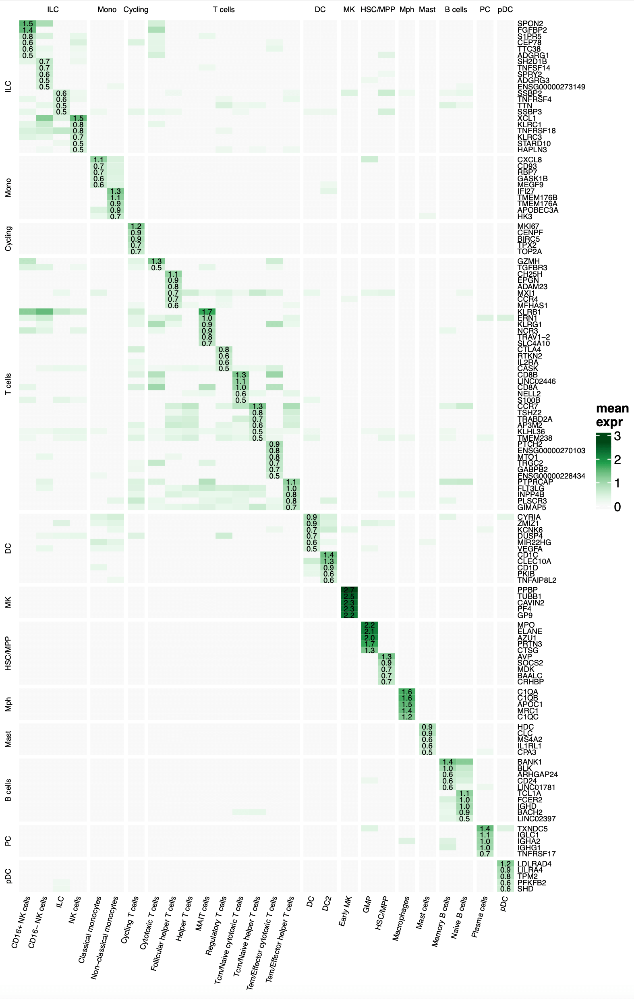
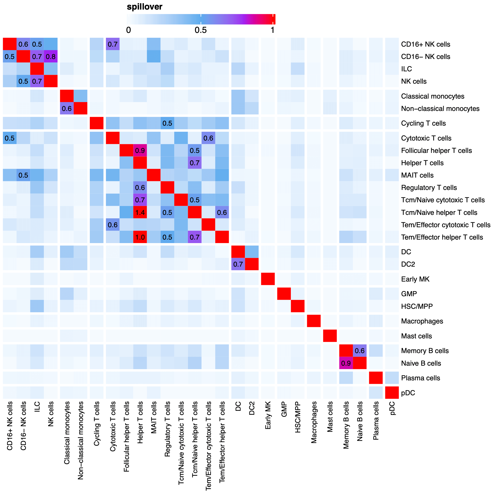
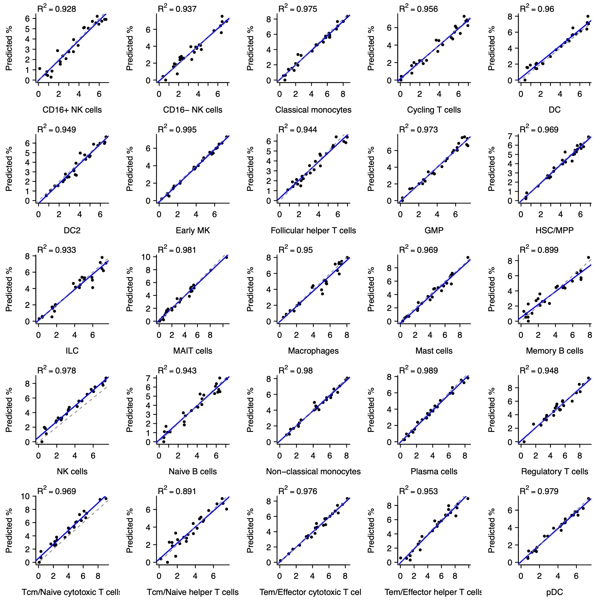

```{r, include = FALSE}
knitr::opts_chunk$set(
  collapse = TRUE
)
```

# Geometric single cell deconvolution

`cellGeometry` has been written for ultrafast deconvolution of bulk RNA-Seq
datasets using a single-cell RNA-Seq reference dataset in which cell clusters
have been defined.

# Installation

Bioconductor version >=3.20 must be installed first for this package to install
correctly. For full package functionality, particularly with sparse matrices
stored on disc in the h5ad format, we recommend that the Bioconductor packages
zellkonverter, rhdf5 and HDF5Array must also be installed to be able to read
h5ad files. If you are using Seurat, then it needs to be installed. We also
recommend installing AnnotationHub to enable conversion of ensembl gene ids to
symbols.

```{r eval = FALSE}
# Bioconductor must be installed +/- updated first
BiocManager::install(version = "3.xx")  # set to latest version

# minimum necessary Bioconductor packages to install cellGeometry package
BiocManager::install(c("ensembldb", "DelayedArray"))

# packages needed to read h5ad files
BiocManager::install(c("zellkonverter", "rhdf5", "HDF5Array"))

# optional, if you are using Seurat
install.packages("Seurat")

# package needed to convert ensembl gene ids to symbols
BiocManager::install("AnnotationHub")
```

Install from Github
```{r eval = FALSE}
devtools::install_github("myles-lewis/cellGeometry")
```

# Algorithm

The algorithm is performed in two stages:

1. Optimal gene markers for each cell subclass are identified. In this part,
each gene is considered as a vector in high dimensions with cell clusters as
dimensions.

2. The bulk RNA-Seq is deconvoluted by calculating the vector projection of each
bulk RNA-Seq sample against a vector representing each cell cluster in high
dimensional gene marker space using the vector dot product. In order to adjust
for spillover in the vector projection between cell clusters, a compensation
matrix is applied.

After each of these stages, diagnostics can be performed and either the gene
signature or deconvolution can be updated.

```{r, out.width='100%', echo=FALSE}
knitr::include_graphics("workflow.png")
```

# Example dataset

## h5ad file

The following example is based on a the Cell Typist dataset (Global) which
contains 329,762 immune cells and is available on the CZ cellxgene repository,
described here:
https://cellxgene.cziscience.com/collections/62ef75e4-cbea-454e-a0ce-998ec40223d3

The h5ad file (2.9 Gb) for the example can be downloaded from CZ cellxgene
repository directly using this link:
https://datasets.cellxgene.cziscience.com/2ac906a5-9725-4258-8e36-21a9f6c0302a.h5ad

First we load the file in HDF5 format so that the full data remains on disc and
only subsets of the data are loaded/processed when necessary using the HDF5Array
and DelayedArray packages.

It is strongly recommended that the file is located on a fast local drive,
preferably an SSD, and not a networked drive. For example, an analysis of a
midsized dataset only took 10 minutes when the h5 file was stored on a local
SSD, compared to 3 hours when the file was stored on a NAS.

```{r eval = FALSE}
library(zellkonverter)
library(SingleCellExperiment)
library(cellGeometry)

typist_h5 <- readH5AD("2ac906a5-9725-4258-8e36-21a9f6c0302a.h5ad",
                      use_hdf5 = TRUE, reader = "R")
```

We extract the main count matrix and cell metadata. cellGeometry needs rownames
on the count matrix.

```{r eval = FALSE}
mat <- typist_h5@assays@data$X
rownames(mat) <- rownames(typist_h5)
meta <- typist_h5@colData@listData
```

## Seurat file

Some users report difficulties with installing zellkonverter which needs working
python libraries. cellGeometry can also be used with Seurat files although these
become progressively slower with larger datasets as well as needing substantial
amounts of RAM, so for datasets >1M cells we recommend persevering with
zellkonverter and the h5ad format since it is much faster. We include example
code for loading a Seurat file below as an alternative to h5ad.

At time of writing the rds file (2.9 Gb) in Seurat format can be downloaded from
CZ cellxgene repository directly using this link:
https://datasets.cellxgene.cziscience.com/2ac906a5-9725-4258-8e36-21a9f6c0302a.rds

CZ cellxgene state that Seurat support will end after Dec 2024.

```{r eval=FALSE}
library(Seurat)
typist <- readRDS("2ac906a5-9725-4258-8e36-21a9f6c0302a.rds")  # 15.5 GB in memory

mat <- typist@assays$RNA$counts
meta <- typist@meta.data
```

# Obtain gene signatures

## Extract cell clusters

We first check cell cluster subclasses. Then we extract a vector which contains
the subclass cluster for each cell and a 2nd vector for broader cell groups. We
restrict the dataset to blood so that we can deconvolute blood bulk RNA-Seq data
later (since tissue-based cells should not be found in peripheral blood
samples). This reduces the analysis to 27,602 cells out of the total 329,762
cells and reduces the number of subclasses from 43 to 27. This is entirely
optional and the algorithm can easily run the full analysis.

```{r eval = FALSE}
table(meta$Majority_voting_CellTypist)

subcl <- meta$Majority_voting_CellTypist
cellgrp <- meta$Majority_voting_CellTypist_high

# reduce dataset to only blood (optional)
subcl[meta$tissue != "blood"] <- NA
cellgrp[meta$tissue != "blood"] <- NA
```

## Create gene signature

We then run the 1st stage of cellGeometry which generates mean gene expression
for each cell cluster (this is the slowest part). Then the best cell cluster and
cell group gene markers are identified.

```{r eval = FALSE}
mk <- cellMarkers(mat, subclass = subcl, cellgroup = cellgrp,
                  dual_mean = TRUE, cores = 2)
```

The `dual_mean` argument only needs to be set for the purpose of the simulation
later. Most users do not need to set this. It calculates both the standard mean
gene expression, which is mean(log<sub>2</sub>(counts +1)), as well as the
arithmetic mean of the (unlogged) counts.

The derivation of mean gene expression for each cluster and cell group is the
slowest part. If you are on linux or mac, this can be sped up using
parallelisation by setting `cores = 2` or more. Note that this can increase
memory requirements dramatically unless HFD5 is used. For this particular
dataset which is moderate in size, we find significant speed up with 4-8 cores
(64 Gb machine). For very large datasets (>1M cells) if the sc data is kept on
disc via HFD5 then many cores can be used. But if the data or subsets of it have
to be loaded into memory then we typically apportion around 16 Gb per core (e.g.
3 cores on a 64 Gb machine). So the limit on cores depends on the size of the
single-cell data, available RAM and whether HFD5 is used.

Windows users can invoke parallelisation using the future backend and setting up
a multisession plan.

```{r eval = FALSE}
# example code using future for parallelisation on windows
library(future)
plan(multisession, workers = 4)

mk <- cellMarkers(mat, subclass = subcl, cellgroup = cellgrp,
                  use_future = TRUE)
```

We have not specified a bulk RNA-Seq dataset at this stage as this example is
based on simulation alone. However, if you have a bulk RNA-Seq dataset it is
helpful to specify it during the first call to `cellMarkers()`. It is only used
for its rownames to identify genes that overlap between the 2 datasets. The
marker signature can be updated later for different bulk datasets using
`updateMarkers()` (see below).

We convert the ensembl ids in the cellMarkers object using the built-in function
`gene2symbol()`. This needs an ensembl database to be loaded.

```{r eval = FALSE}
library(AnnotationHub)
ah <- AnnotationHub()
ensDb_v110 <- ah[["AH113665"]]
mk <- gene2symbol(mk, ensDb_v110)
```

## Visualise gene signature

The signature gene matrix can be displayed as follows.

```{r eval = FALSE}
signature_heatmap(mk)  # visualise whole signature
signature_heatmap(mk, top = 5)  # show top 5 genes for each subclass
```

```{r, out.width='90%', echo=FALSE}

```

The default signature heatmap shows the gene signature after the noise filter
has been applied. To see the raw gene expression heatmap call
`signature_heatmap()` with `use_filter = FALSE`.

The spillover heatmap between cell clusters can also be visualised.

```{r eval = FALSE}
spillover_heatmap(mk)
```

```{r, out.width='80%', echo=FALSE}

```

This heatmap as well as the signature heatmap reveals that some cell subclasses
'spillover' too strongly into other cell subclasses. In other words some cell
types are too similar - perhaps one is really a closely related subset of the
other. Here we see that Helper T cells are the most affected and their signature
is similar to Tcm/Naive helper T cells.

## Signature diagnostics

When cell clusters exhibit spillover, it is generally because of cell types
being too similar. Cosine similarity is an ideal method for detecting this as it
explicitly measures the angle between the vectors for each cell subclass as
defined by in gene space. `cos_similarity()` generates a cosine similarity
matrix for the cell subclasses, and this can be visualised using a heatmap.

```{r eval = FALSE}
cs <- cos_similarity(mk)
ComplexHeatmap::Heatmap(cs)
```

```{r, out.width='80%', echo=FALSE}

```

The cosine similarity matrix is easily be converted to the angle between the
vectors for each cell subclass using `acos(cs)`. The function `rank_angle()` can
be used to list those pairs of subclasses whose vectors are close together in
terms of the angle between them.

```{r eval = FALSE}
rank_angle(cs)
```

This plus the cosine similarity heatmap confirms that the vector for Helper T
cells is rather similar to the vector for Tcm/Naive helper T cells, which is not
surprising as these cell types overlap.

The `diagnose()` function provides more thorough diagnostics on the gene
signature. It can be used to identify which cell clusters are problematic.
Helper T cells in particular do not have any top ranked markers of their own
since they are largely identical to Tcm/Naive helper T cells in terms of their
gene expression.

```{r eval = FALSE}
diagnose(mk)
```

Below we update the cellMarkers object to remove 2 cell clusters which overlap
with other cell clusters and are therefore likely to be difficult to deconvolute
well if applied to real world bulk RNA-Seq. (For the simulation it actually does
not matter whether these are removed or not since the algorithm is able to
differentiate them sufficiently.)

```{r eval = FALSE}
mk <- updateMarkers(mk,
                    remove_subclass = c("Helper T cells", "Cytotoxic T cells"))
```

## Refine gene signature

The following arguments are available in both `cellMarkers()` or
`updateMarkers()`. They can change and improve which genes are selected for the
gene signature as well as changing the amount of noise reduction in the gene
signature if the filter is applied during deconvolution by `deconvolute()`.

--------------- ---------------------------------------------------------------------------
`nsubclass`     Number of genes to select for each single cell subclass.
                Either a single number or a vector with the number of genes for each
                subclass.
                
`ngroup`        Number of genes to select for each cell group. Either a single
                number or a vector with the number of genes for each group.
                
`expfilter`     Genes whose maximum mean expression on log2 scale per cell
                type are below this value are removed and not considered for the signature.
                
`noisefilter`   Sets an upper bound for `noisefraction` cut-off below
                which gene expression is set to 0. Essentially gene expression above this
                level must be retained in the signature. Setting this higher can allow more
                suppression via `noisefraction` and can favour more highly expressed genes.
                
`noisefraction` Numeric value from 0-1 (default 0.25). Higher values mean more 
                noise suppression. Maximum mean log2 gene expression across
                cell types is calculated and values in celltypes below this fraction are
                set to 0. Set in conjunction with `noisefilter.` Note: if this is set too
                high (too close to 1), it can have a deleterious effect on deconvolution.
--------------- ---------------------------------------------------------------------------

`nsubclass` and `ngroup` simply define how many genes are picked for each
subclass or group. If some subclasses do not have enough specific genes,
lowering `expfilter` is probably the first parameter to try. However as
`expfilter` approaches zero, lots of genes with very low expression but which
appear to be highly specific to a subclass (i.e. only expressed in that subclass
with zero expression in all other cell clusters) will be selected. Although
these might perform well in simulations, our experience is that they are poor
markers in real bulk RNA-Seq.

In addition users have full control over editing the gene list for the subclass
signature using the `add_gene` and `remove_gene` arguments in `updateMarkers()`.
Similarly `add_groupgene` and `remove_groupgene` can be used to edit the gene
list for the broader cell group signatures.

# Deconvolution

## Simulated pseudo-bulk

We can generate pseudo-bulk to test the deconvolution using the following
commands. Here `generate_samples()` makes 25 samples with random cell counts,
`sim_counts`. The simulate_bulk() function operates in 2 modes. In the first
mode, the average gene expression for each cell cluster is extracted from the
cellMarkers object and used to generate the pseudo-bulk totals. In the 2nd
mode (see below) the original single-cell count data is sampled.

```{r eval = FALSE}
# simulated bulk
set.seed(3)
sim_counts <- generate_samples(mk, 25)
sim_percent <- sim_counts / rowSums(sim_counts) * 100
sim_pseudo <- simulate_bulk(mk, sim_counts)
```

Deconvolution itself is performed as a 2nd function `deconvolute()`. The
`plot_set()` function can be used to plot the results. The `metric_set()`
function generates a table of results.

```{r eval = FALSE}
# mode 1: (perfect deconvolution)
fit <- deconvolute(mk, sim_pseudo,
                   use_filter = FALSE)
plot_set(sim_counts, fit$subclass$output)
plot_set(sim_percent, fit$subclass$percent)

metric_set(sim_percent, fit$subclass$percent)  # table of results
```

## Sampled pseudo-bulk

In the 2nd mode, the original scRNA-Seq count dataset is sampled. The sampling
rate of the actual cell counts in `sim_counts` can be increased by setting
`times`. Cells are sampled with replacement. The desired cell counts are simply
multiplied by `times` prior to sampling. By default, sampling is performed using
the Dirichlet distribution as this gives true random sampling in comparison to
uniform sampling. When cells are oversampled uniformly, in the limit the summed
gene expression tends to the arithmetic mean of the subclass x sample frequency
(which is a much easier deconvolution problem compared to Dirichlet sampling).
This can be demonstrated by using uniform sampling and steadily increasing
`times` from 1 to 30-100 or more. This improves the deconvolution as the sum of
the gene counts per sampled cell approaches the arithmetic mean of gene counts
for each cell cluster.

```{r eval = FALSE}
# mode 2: sample from original sc count matrix
# 1.43 mins (Intel); 45 secs (ARM)
set.seed(99)
times <- 1  # can be increased
sim_sampled <- simulate_bulk(mat, sim_counts, subcl, times = times)

# fix rownames
rownames(sim_sampled) <- gene2symbol(rownames(sim_sampled), ensDb_v110)

# near optimal deconvolution of counts sampled from the original scRNA-Seq
fit2 <- deconvolute(mk, sim_sampled,
                    use_filter = FALSE, arith_mean = TRUE)

# plot results
plot_set(sim_counts, fit2$subclass$output / times)  # adjust for oversampling using `times`
plot_set(sim_percent, fit2$subclass$percent)

metric_set(sim_percent, fit2$subclass$percent)
```

```{r, out.width='90%', echo=FALSE}

```

Results are returned in `fit$subclass$output` for standard output (theoretically
in numbers of cells), `fit$subclass$percent` for output converted to percentage
of total cells for each sample. The group analysis is returned in a similar vein
in `fit$group$output` and `fit$group$percent`.

## Real bulk RNA-Seq settings

We recommend that bulk RNA-Seq sample data is provided as raw counts.
Log<sub>2</sub> transformed data can be inputted, but it is important that the
transformed data is *not* offset, i.e. the algorithm expects that zero in the
bulk really means zero expression. Some transformation methods, e.g. variance
stabilising transform (VST), mean that there is an offset so that zero counts
equates to a positive number. This typed of transformed data cannot be used.

With a real bulk RNA-Seq dataset the first step is to ensure that only genes
which are present in the bulk data are used for the gene signatures. This is
achieved using the function `updateMarkers()`.

```{r eval = FALSE}
mk <- updateMarkers(mk, bulkdata = my_bulk_matrix)
```

Alternatively bulk data can be supplied with the first call to `cellMarkers()`.
`updateMarkers()` can also be used to rapidly update the marker object `mk` with
new settings, e.g. to alter the number of genes used per subclass or manually
edit (add/remove) the marker genes. Note that if some signature genes are
missing from the bulk data, `deconvolute()` will stop with an error message that
some signature genes are missing.

Note that the settings shown above are mathematically ideal for simulated bulk
data. In reality, we expect the scRNA-Seq signature to differ from real-world
bulk RNA-Seq due to differences in chemistry and the amplification step required
by single-cell sequencing. So we recommend the default settings for real-world
bulk data when calling `deconvolute()`. The main settings to choose here are:

--------------  ----------  -----------  ---------------------------------------------
Parameter       Optimal     Real-world   Purpose
                simulation  recommended    
--------------  ----------  -----------  ---------------------------------------------
`count_space`   TRUE        TRUE         Toggles whether the deconvolution is performed in 
                                         count space (exponential space) or in log<sub>2</sub> space.

`weight_method` "equal"     "equal"      Scaling is applied so that each gene in the gene signature has equal
                                         weight.

`convert_bulk`  FALSE       FALSE        Converts the bulk RNA-Seq onto scRNA-Seq data scale 
                                         based on a reference dataset in which both bulk and 
                                         scRNA-Seq were performed simultaneously.

`use_filter`    **FALSE**   TRUE         Reduces the overall amount of spillover & compensation 
                                         by denoising the gene signatures.

`arith_mean`    **TRUE**    FALSE        Whether to use arithmetic mean of counts or the standard 
                                         log<sub>2</sub> mean.
--------------  ----------  -----------  ----------------------------------------------

We recommend `use_filter` is always on for real-world bulk analysis as it reduces
the compensation burden particularly for genes where non-specific low level
expression is present in some cell clusters which can occur even for good
markers. We suggest `deconvolute()` is used in one of 2 modes: either
`convert_bulk = TRUE` or `count_space = TRUE`, but **not both**.

There is also a powerful function `tune_deconv()` which allows users to tune any
of the parameters available in `updateMarkers()` based on a bulk reference
dataset. The simulated pseudo-bulk data can be used for this purpose, but real
bulk RNA-Seq would be better (more realistic and better for tuning).

Also, 2 scRNA-Seq datasets can be merged using the function `mergeMarkers()`.
This merges the `cellMarkers` objects derived from each single cell dataset. One
dataset is defined as reference, and the 2nd dataset is merged into it after
adjustment for its overall distribution based on quantile mapping.

# Tuning deconvolution

The function `tune_deconv()` can be used with the sampled pseudo-bulk matrix
`sim_sampled` which we generated earlier to see the effect of tuning parameters
for deconvolution. Note there are important mathematical caveats to understand
when using tuning. Below we tune over a range of `nsubclass` values from 5 up to
1000, vary the low expression filter `expfilter` from 0.05 up to 1.5, and also
tune `weight_method` to either "none" or "equal". But any argument which can be
passed to `updateMarkers()` can be tuned. Arguments which are not in the tuning
list specified through the argument `grid` such as `arith_mean` and `use_filter`
in the example below are applied constantly. Parallelisation is available on
unix systems but not on windows.

```{r eval = FALSE}
res <- tune_deconv(mk, sim_sampled, sim_counts * times,
                   grid = list(nsubclass = c(5, 10, 15, 25, 50, 100, 200, 500, 1000),
                               expfilter = c(0.05, 0.1, 0.25, 0.5, 0.75, 1, 1.5),
                               weight_method = c("none", "equal")),
                   arith_mean = TRUE,
                   use_filter = FALSE,
                   cores = 8)

## Tuning parameters: nsubclass, expfilter, weight_method
##   |==========================================================| 100%, Elapsed 00:07
## Best tune:
##   nsubclass  expfilter  weight_method  mean.RMSE
##        1000       0.25          equal      35.21
```

When tuning it is important not to forget the effect of `times` in
`simulate_bulk()`. That is why the supplied true cell counts matrix `sim_counts`
is multiplied by the oversampling factor `times` in the above example.

The results of tuning can be plotted using the function `plot_tune()`.

```{r eval = FALSE}
plot_tune(res, xvar = "nsubclass", group = "weight_method")
plot_tune(res, xvar = "nsubclass", group = "expfilter")
plot_tune(res, xvar = "expfilter", group = "weight_method")
plot_tune(res, xvar = "expfilter", group = "nsubclass")
```

```{r, out.width='90%', echo=FALSE}

```

These plots show that `weight_method = "equal"` is better than `"none"` and that
`expfilter` for this single cell dataset seems to be optimal at around 0.25. In
this simulation the higher `nsubclass` is the better, with deconvolution best
with 500-1000 genes per subclass. In reality we find that this is unlikely to be
true for real-world bulk RNA-Seq as noise caused by differences in sequencing
chemistry mean that larger numbers of genes in the signature add increasing
noise, so there is likely to be a sweetspot. The default `nsubclass` is 25 which
has been chosen as a plausible compromise which should work in most situations.

## Simulating noise

The package provides several noise adding functions which can be applied to the
sampled simulation dataset.

```{r eval = FALSE}
# simple gaussian noise applied to counts
sim_noise <- add_noise(sim_sampled)

# noise applied to log2 counts
sim_noise <- log_noise(sim_sampled)

# noise applied to sqrt transformed counts
sim_noise <- sqrt_noise(sim_sampled)

# whole genes are scaled up/down by a random amount
# this simulates differences in chemistry
sim_noise <- shift_noise(sim_sampled)
```

Tuning can then be tested on the simulation data with added noise to see how
tolerant the deconvolution parameters are to different types of noise.

```{r eval = FALSE}
res2 <- tune_deconv(mk, sim_noise, sim_counts,
                   grid = list(nsubclass = c(5, 10, 15, 25, 50, 100, 200, 500, 1000),
                               expfilter = c(0.05, 0.1, 0.25, 0.5, 0.75, 1, 1.5),
                               weight_method = c("none", "equal")),
                   arith_mean = TRUE,
                   use_filter = FALSE,
                   cores = 8)
```

We find that the addition of simple noise to the simulation dataset tends to
prefer higher `nsubclass` as this averages out the noise across more markers.
`shift_noise` which simulates differences in chemistry tends to show that the
low expression filter `expfilter` becomes increasingly important and that there
is a maximum limit to `nsubclass`.
